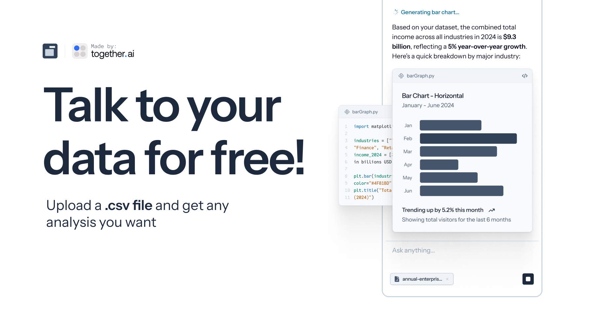

# Askable

<div align="center">
    
    <h1>Askable</h1>
    <p>
        <strong>Chat with your CSV files using AI.</strong> Upload a CSV, ask questions in plain English, and get instant, code-backed answers and visualizations.
    </p>
</div>

## Features

- **Intuitive Chat Interface:** Ask questions about your data in a natural, conversational way.
- **CSV Upload & Analysis:** Easily upload your CSV files. Askable analyzes the headers and content to understand your data's structure.
- **AI-Powered Insights:** Leverages Large Language Models (LLMs) via OpenRouter to understand your questions and generate relevant insights.
- **Code Generation:** For each answer, Askable generates the Python code (using libraries like Pandas) that would be used to retrieve and process the data. **Note:** The code is generated for transparency and educational purposes but is not executed within the app.
- **Smart Suggestions:** Provides suggested questions to help you get started with your data exploration.
- **Chat History:** Your conversations are saved, allowing you to revisit previous insights.

## Tech Stack

- **Framework:** [Next.js](https://nextjs.org/)
- **Language:** [TypeScript](https://www.typescriptlang.org/)
- **Styling:** [Tailwind CSS](https://tailwindcss.com/) & [Shadcn UI](https://ui.shadcn.com/)
- **AI:** [OpenRouter](https://openrouter.ai/) for LLM integration.
- **Database:** [TiDB Serverless](https://www.pingcap.com/tidb-serverless/) for storing chat history and metadata.
- **File Storage:** [AWS S3](https://aws.amazon.com/s3/) for handling CSV file uploads.
- **UI/Animation:** [Framer Motion](https://www.framer.com/motion/)

---

## Getting Started

Follow these instructions to set up and run Askable on your local machine.

### Prerequisites

- **Node.js:** v20.x or higher.
- **npm:** (should be included with Node.js)
- **Git**
- **Cloud Service Accounts:**
    - **OpenRouter:** For access to various LLMs.
    - **TiDB Cloud:** For a serverless database instance.
    - **AWS:** For an S3 bucket to store uploaded CSVs.

### 1. Clone the Repository

```bash
git clone https://github.com/your-username/askable.git
cd askable
```

### 2. Install Dependencies

Install the necessary packages using `npm`.

```bash
npm install
```

### 3. Set Up Environment Variables

Create a `.env` file in the root of the project by copying the example file:

```bash
cp .example.env .env
```

Now, open the `.env` file and fill in the required values:

- **OpenRouter:**
  - `OPENROUTER_API_KEY`: Your API key from OpenRouter.

- **TiDB Database:**
  - `TIDB_HOST`: Your TiDB cluster host.
  - `TIDB_USER`: Your TiDB user.
  - `TIDB_PASSWORD`: Your TiDB password.
  - `TIDB_DATABASE`: The name of your database.

- **AWS S3 for Uploads:**
  - `S3_UPLOAD_KEY`: Your AWS Access Key ID.
  - `S3_UPLOAD_SECRET`: Your AWS Secret Access Key.
  - `S3_UPLOAD_BUCKET`: The name of your S3 bucket.
  - `S3_UPLOAD_REGION`: The AWS region of your bucket (e.g., `us-east-1`).

### 4. Run Database Migrations

This application uses a TiDB serverless database. You need to run a script to create the necessary tables (`chats` and `rate_limits`).

The script uses `tsx` to execute the TypeScript migration file. If you don't have `tsx` installed globally, you can install it as a dev dependency:
```bash
npm install --save-dev tsx
```

Then, run the migration script:

```bash
npx tsx scripts/migrate-db.ts
```

You should see a success message indicating that the tables were created.

### 5. Run the Application

Start the Next.js development server. The `--turbopack` flag is recommended for faster performance.

```bash
npm run dev
```

Open [http://localhost:3000](http://localhost:3000) in your browser to use Askable.

---

## How It Works

1.  **Upload:** A user uploads a CSV file, which is securely stored in an AWS S3 bucket.
2.  **Analysis:** The application analyzes the CSV headers and sends them to the LLM to generate a set of insightful initial questions.
3.  **Chat:** The user asks a question about the data.
4.  **AI Processing:** The question, along with the data context, is sent to an LLM via OpenRouter.
5.  **Code Generation:** The LLM's primary task is to generate a Python script that can answer the question.
6.  **Response:** The application displays the LLM's natural language answer and the generated Python code. The code itself is not executed.
7.  **Storage:** The entire conversation (messages, generated code, etc.) is stored in the TiDB database for persistence.

## License

This project is licensed under the [MIT License](./LICENSE).
